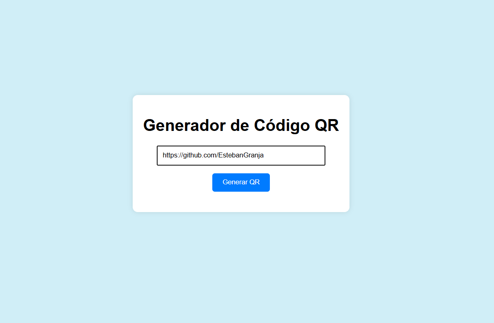
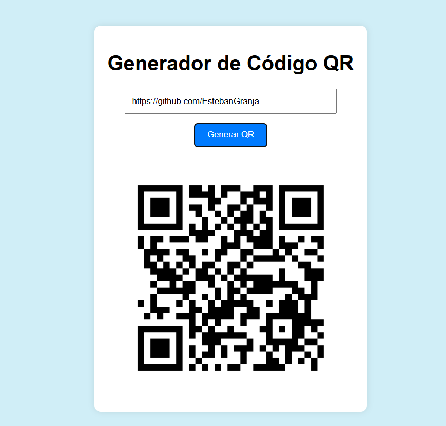

# QR Generator

Una aplicación web simple que convierte enlaces o texto en códigos QR, desarrollada con Python y Flask.

## Descripción

**QR Generator** es una herramienta sencilla para generar códigos QR de manera rápida. Basta con ingresar un texto o enlace, y la aplicación generará automáticamente el código QR correspondiente. Ideal para compartir información en un formato visual fácil de escanear.

---

## Funcionalidades

- Generar un código QR a partir de texto o enlaces.
- Interfaz web intuitiva para ingresar datos y visualizar resultados.
- Respuesta en tiempo real gracias a Flask y el procesamiento del backend.

---

## Capturas de pantalla

### Pantalla principal


### Código QR generado


---

## Tecnologías utilizadas

- **Python**: Lógica del backend.
- **Flask**: Framework para construir la aplicación web.
- **qrcode**: Biblioteca para la generación de códigos QR.
- **HTML/CSS**: Diseño de la interfaz.

---

## Requisitos previos

Antes de ejecutar este proyecto, asegurate de tener instalado lo siguiente:

- **Python 3.8+**
- **pip** (gestor de paquetes de Python)

---

## Instalación

1. Cloná este repositorio:
   ```bash
   git clone https://github.com/tu_usuario/QR-Generator.git
   cd QR-Generator
