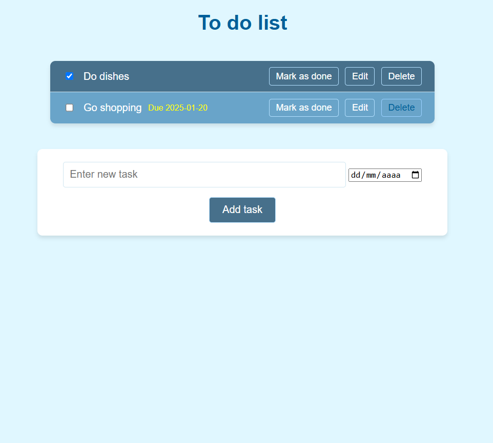

# To-Do List

Una aplicación web para organizar tus tareas de manera eficiente, permitiéndote agregar, editar, marcar como completadas y asignarles fechas.

## Descripción

**To-Do List** es una herramienta sencilla y práctica para gestionar tareas pendientes. Podés registrar nuevas tareas, actualizarlas, marcarlas como completadas, y organizarlas con fechas asignadas. Es ideal para mantener el control de tus actividades diarias o proyectos.

---

## Funcionalidades

- **Agregar tareas:** Registrar nuevas actividades con un título y fecha.
- **Editar tareas:** Modificar el contenido o la fecha de una tarea existente.
- **Marcar como hechas:** Identificar rápidamente las tareas completadas.
- **Interfaz limpia y sencilla:** Desarrollada con HTML y CSS para facilitar la navegación.

---

## Captura de pantalla



---

## Tecnologías utilizadas

- **Python:** Para la lógica del backend.
- **Flask:** Framework web para el desarrollo del servidor.
- **HTML/CSS:** Para el diseño de la interfaz del usuario.

---

## Requisitos previos

Antes de ejecutar este proyecto, asegurate de tener instalado lo siguiente:

- **Python 3.8+**
- **pip** (gestor de paquetes de Python)

---

## Instalación

1. Cloná este repositorio:
   ```bash
   git clone https://github.com/tu_usuario/To-Do-List.git
   cd To-Do-List
